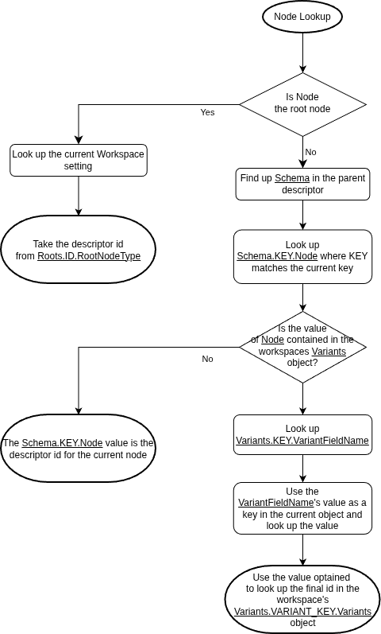

# NodeEditor Internals

The Hytale Node editor is downloaded as part of the client, is stand alone and lives next to the ``HytaleClient`` binary in a folder called ``NodeEditor``.

Next to the ``NodeEditor.exe`` are two DLLs ``Noesis.dll`` and ``NoesisApp.dll`` indicating this program uses the Noesis UI framework.

The App can be launched on Windows by executing ``NodeEditor.exe`` directly.

## Workspaces

The most important folder seems to be ``Workspaces`` which holds the vast majority of available nodes including their inputs/outputs, schema, group and variants.

The only nodes not shown in those files are the ones in the "Generic" group (e.g. the link node).

### File: _Workspace.json

| Field / Path  | Optional | Json Type | Usage |
| ------------  | -------- |---------- | ----- |
| WorkspaceName |   ?      |  String   | Basic name of the workspace. (Unused in the UI)
| ExportDefaults|   ?      |  Bool     | *Unknown* 
| Roots         | No       |  Object   | Lists variants of Workspaces + The root node for that variant
| Roots.*ID*.RootNodeType | No | String | The identifier of the root node type 
| Roots.*ID*.MenuName | No     | String | Name shown in the dropdown menu for selecting the Workspace type
| NodeCategories | Yes     |  Object  | List of Categories the Nodes are grouped into |
| NodeCategories.*ID*| Yes |  List    | List of node names (String) contained in this category
| Variants       | Yes     |  Object  | Variants that nodes can have (See variant lookup)
| Variants.*ID*.VariantFieldName   | No     |  String  | Key used to identify the variant during lookup
| Variants.*ID*.Variants           | No     | Object   | A Key-Value lookup mapping the variant key to the final node name 

**Note:** If a Node is not contained in any NodeCategories it will per default be added to a dynamically defined group called "Uncategorized"

### File schema for Workspace JSONs
| Field / Path  | Optional | Json Type | Usage |
| ------------  | -------- |---------- | ----- |

### Variant lookup

> For simplicity I'll use the follwing terms
> * **Descriptor** = The JSON file part of the Workspaces directories for that node type
> * **Workspace** = The ``_Workspace.json`` file
> * **Node Tree** = The assets json file (not part of the workspace) 
> * **Node Tree Parent** = The json object in the node tree of the parent node
> * **Node Tree Position** = The json object in the node tree of the current node
> * **Parent Descriptor** = The descriptor/type associated with the parent node
> * **Current Key** = The json key under which the parent has defined the current object

In order to figure out the node type needs is used for a given asset JSON object the consider the following lookup algorithm:

1. If it's the root node it's node type is already defined by the ``Roots`` table in the ``_Workspace.json``

2. Look up the ``Schema`` entry matching the current key we get the variant key by taking this schema key's ``Schema.<Key>.Node`` field.

3. Look up the variant key in the workspace ``Variants`` table. It it is *NOT* contained this variant key represents the actual descriptor id and we are done. Proceed if it is contained.

4. Take the ``Variants.<Variant Key>.VariantFieldName``. It's the name of a field that *MUST* exist in the current node tree position and it *MUST* resolve to a string.

5. Use the string optained in the previous step and look it up in the ``Variants.<Variant Key>.Variants`` table. The value optained there is the actual descriptor id and we are done.

